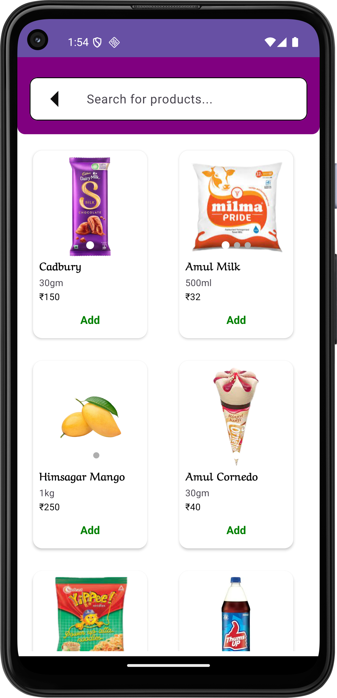
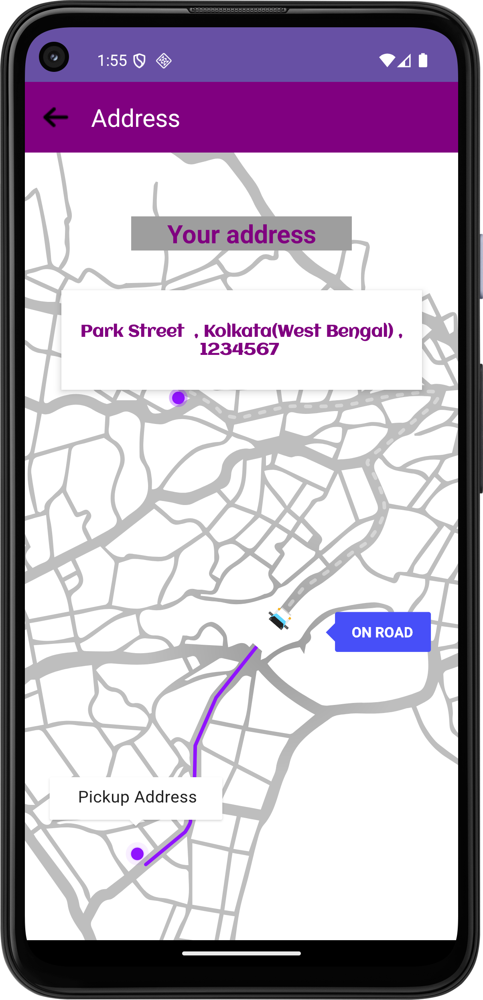

# 🚀 Full-Stack Android eCommerce Solution – Buyer & Seller Apps  
*(This is the Buyer version)*  
**Seller Version** 👉 [ShopEase_frSeller](https://github.com/101paul/ShopEase_frSeller)

An end-to-end **native Android eCommerce ecosystem**, designed to deliver a seamless, real-time, and secure experience for both **buyers** and **sellers**.

---

## 📱 Two Apps – One Powerful Ecosystem

  

This project includes **two fully functional Android applications**, built from the ground up:

- 🛒 **Buyer App** – For browsing products, managing cart, placing orders, making secure payments, and tracking delivery  
- 🛍️ **Seller App** – For uploading products, managing stock, and processing incoming orders  

---

## 🛠️ Tech Stack & Architecture

  
  
  

- **Kotlin + XML** – Modern, fast, and intuitive native UI development  
- **MVVM Architecture** – Clean code separation and lifecycle-aware components  
- **Room Database** – Efficient offline access and persistent cart state  
- **SharedPreferences** – Lightweight local state management  
- **Firebase Realtime Database** – Instant syncing of orders, stock, and product data  
- **Firebase Cloud Storage** – Fast and scalable image uploads & retrieval  

  
  

---

## 🔐 Authentication & Security

  
  

- **OTP Login via Firebase Authentication**
  - Secure, passwordless access  
  - Fast mobile number verification  
  - Seamless onboarding for both buyers and sellers  

  
  

---

## 💳 Payment Gateway Integration

  
  
  

- **Razorpay Payment Gateway**
  - Smooth and secure payment flow  
  - Handles multiple payment methods (UPI, cards, wallets)

- **Custom Java + Spring Boot Backend**
  - Generates secure Razorpay order IDs  
  - Validates and verifies payment transactions  
  - Protects sensitive user credentials  
  - Ensures full-stack transaction integrity  

  
  

---

## ⚡ Real-Time Buyer-Seller Sync

- Live updates on:
  - New orders  
  - Stock changes  
  - Product additions or edits  
- Instant notification to buyers when orders are packed, shipped, or delivered  

---

## 🧠 Smart Cart & Order Management

  
  
  

- Real-time cart updates using Room + Firebase  
- Auto-clears cart when quantity hits zero  
- Post-order stock deductions reflected immediately in the seller app  

---
## 🔍 Search box 

  

---
## 📍Address 

  

---
## ✅ Why This App Stands Out

- 100% **native Android** development  
- Clean, scalable **MVVM** architecture  
- Full-stack: From **UI to backend payment verification**  
- **Secure**, **real-time** and **production-ready**  
- Offline support for smoother experience  
- Ideal for launching a **mobile-first eCommerce solution**  

---

## 📦 Features At A Glance

| Feature                            | Buyer App ✅ | Seller App ✅ |
|-----------------------------------|--------------|----------------|
| OTP Login                         | ✅           | ✅             |
| Realtime Cart                     | ✅           |                |
| Product Upload & Management       |              | ✅             |
| Stock Management                  |              | ✅             |
| Live Order Updates                | ✅           | ✅             |
| Razorpay Payment Gateway          | ✅           |                |
| Order Verification via Backend    | ✅           | ✅             |
| Firebase Sync (Realtime + Images) | ✅           | ✅             |
| Offline Cart Storage (Room)       | ✅           |                |
